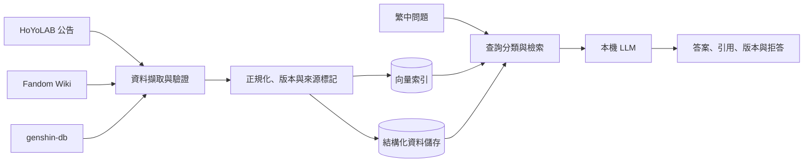

# Genshin-Impact-RAG-Helper 專案計畫書

| 文件項目 | 內容 |
|---|---|
| 文件版本 | 1.0 Approved |
| 文件日期 | 2026-08-20 |
| 核准日期 | 2026-08-20 |
| 專案類型 | 個人 Side Project／非商業用途 |
| 專案週期 | 8 週 |
| 預估投入 | 每週 8–10 小時；總工時 64–80 小時 |
| 每月預算上限 | NT$0 |
| 版控平台 | GitHub |

## 1. 執行摘要

Genshin-Impact-RAG-Helper 是一套服務繁體中文玩家的《原神》知識助手。系統整合 HoYoLAB 官方公告、Genshin Impact Fandom Wiki 與 genshin-db，讓使用者以自然語言查詢角色、武器、素材、任務、世界觀及版本資訊，並取得附來源、版本與資料時間的回答。

本專案採 Retrieval-Augmented Generation（RAG），將檢索與回答生成分開評估。系統在資料不足或來源衝突時，應明確拒答或提示不確定性，不以模型既有知識補出沒有依據的答案。

專案採一般軟體開發生命週期（SDLC）管理，依序完成專案規劃、系統分析（SA）、系統設計（SD）、Task 切分、開發、測試、CI/CD 與版本發布。第一版以本機可執行、零月費及可重現為主要交付方向，不承諾提供 24/7 公開服務。

## 2. 背景與問題陳述

《原神》資料分散於官方公告、社群 Wiki 與結構化資料庫，各來源的格式、更新頻率及可信度不同。玩家查詢資料時，往往需要跨網站搜尋、比對版本並判斷內容是否過期。

本專案欲解決下列問題：

1. 資料分散，使用者必須在多個網站間切換。
2. 同一問題可能存在新舊版本或來源衝突。
3. 一般聊天模型可能在沒有可靠資料時產生看似合理的錯誤答案。
4. 結構化數值與長篇敘述資料需要不同的查詢方式。
5. 使用者難以追溯答案依據及確認資料時間。

## 3. 專案定位與目標使用者

### 3.1 專案定位

一套提供繁體中文自然語言查詢、具來源引用及版本意識的《原神》RAG 知識助手。

### 3.2 目標使用者

想快速查詢《原神》資料，並重視答案來源、版本與可追溯性的繁體中文玩家。

### 3.3 專案目標

1. 支援繁體中文自然語言問答。
2. 涵蓋角色、武器、素材、任務、世界觀及版本資訊。
3. 所有非拒答答案均提供可追溯來源。
4. 優先採用官方與較新資料，並標示版本或資料時間。
5. 資料不足或來源衝突時，不產生無依據的肯定答案。

## 4. 專案範圍

### 4.1 MVP 納入範圍

| 類別 | 納入內容 |
|---|---|
| 角色 | 基本資料、技能、命座、角色故事 |
| 武器 | 名稱、類型、稀有度、數值及效果 |
| 素材 | 名稱、類型、用途；不含取得方式 |
| 任務與世界觀 | 任務摘要、人物關係、地區及背景設定；回答需支援劇透提示 |
| 版本資訊 | 更新內容、調整、修正及已知問題 |

### 4.2 MVP 排除範圍

1. 素材取得方式、採集位置及路線規劃。
2. 配隊、聖遺物及抽卡建議。
3. 個人帳號、角色庫或遊戲紀錄分析。
4. 測試服、洩漏或尚未正式發布的資料。
5. 24/7 公開服務及商業化營運。

## 5. 資料來源策略

### 5.1 第一版資料來源

| 來源 | 主要用途 | 權威優先級 | 更新原則 |
|---|---|---:|---|
| [HoYoLAB 官方公告](https://www.hoyolab.com/official/2/notices) | 版本更新、修正、已知問題 | 1 | 新版本公告發布後 7 天內更新 |
| [genshin-db](https://github.com/theBowja/genshin-db) | 角色、武器、技能、素材等結構化資料 | 2 | 每月檢查更新 |
| [Genshin Impact Fandom Wiki](https://genshin-impact.fandom.com/wiki/Genshin_Impact) | 任務、角色故事、世界觀及補充說明 | 3 | 每月檢查更新 |

### 5.2 衝突處理原則

當來源內容衝突時，以 HoYoLAB 官方公告為最高優先，其次為 genshin-db，最後為 Fandom Wiki。系統應保存來源、發布日期、擷取時間及適用版本。若無法確認正確內容，回答應顯示衝突並拒絕作出單一肯定結論。

### 5.3 授權與資料治理

- Fandom 文字內容通常採 CC BY-SA，使用時需保留署名、原文連結及相同方式分享要求；以其[授權說明](https://www.fandom.com/zh/licensing-zh)為準。
- genshin-db 專案程式碼標示 MIT License，但遊戲資料仍涉及原始內容權利；Repo 應保留來源及權利聲明。
- HoYoLAB／HoYoverse 素材僅用於非商業個人專案，依其[法律 FAQ](https://www.hoyolab.com/article/143107)及服務條款處理。
- GitHub Repo 不提交大量第三方原始內容，只保存程式碼、擷取設定、來源清單及少量測試 fixture。
- 詳細擷取方法、robots.txt、API 限制及資料保存策略，於 SA／SD 階段確認後才實作。

## 6. 高階需求

### 6.1 功能需求

| ID | 需求 |
|---|---|
| FR-01 | 使用者可使用繁體中文輸入自然語言問題。 |
| FR-02 | 系統可回答 MVP 範圍內的角色、武器、素材、任務、世界觀及版本問題。 |
| FR-03 | 非拒答答案必須附上來源連結及可用的版本／時間資訊。 |
| FR-04 | 系統能依來源權威性及時間處理衝突資料。 |
| FR-05 | 資料不足、問題超出範圍或證據衝突時，系統應拒答或標示不確定性。 |

### 6.2 非功能需求方向

| 類別 | 計畫要求 |
|---|---|
| 成本 | 核心功能不得依賴付費 API 或需付費才能持續運作的服務。 |
| 可重現性 | 新環境可依 README 建立並執行本機 Demo。 |
| 可維護性 | 資料擷取、正規化、檢索、生成與 UI 應保持模組化。 |
| 隱私 | MVP 不收集遊戲帳號、登入資訊或個人資料。 |
| 可觀測性 | 保存查詢、檢索結果、引用及評估結果；不得保存敏感資料。 |

回應時間、資源用量及詳細可用性門檻將於 SA 階段基於本機模型實測後訂定。

## 7. 高階解決方案

以下為規劃階段概念架構，實際元件與介面由 SD 文件定案。

規劃中的技術方向：

- 本機 7B／8B 級、4-bit 量化模型作為穩定基準。
- 本機多語系 Embedding 模型及向量資料庫。
- 精確數值優先走結構化查詢，敘述性問題走 RAG。
- CI 使用 Mock LLM；完整 RAG 評估在本機硬體執行。
- 確切模型、Embedding、Vector DB、Framework 與 UI 技術在 SD 階段以 ADR 決定。

## 8. RAG 品質與驗收標準

### 8.1 MVP 品質門檻

| 指標 | Release Gate |
|---|---:|
| 回答正確率 | ≥ 90% |
| Retrieval Recall@5 | ≥ 90% |
| 引用支持答案率／Groundedness | ≥ 95% |
| 無資料正確拒答率 | ≥ 90% |
| 非拒答答案附來源率 | 100% |

### 8.2 評估資料集

- 第一版建立 50 題人工確認題庫：40 題可回答、10 題應拒答。
- 每題保存預期答案、必要事實、適用版本及正確來源。
- 自動評估搭配人工複核，不完全依賴 LLM-as-a-Judge。
- CI 執行可重現的非模型測試；完整 50 題模型評估於本機執行。
- 後續將題庫擴充至 100 題，以降低對固定少量題目的過度最佳化。

RAG 評估將分開衡量檢索與生成品質，參考 [RAGAS](https://aclanthology.org/2024.eacl-demo.16/)、[NVIDIA RAG 評估文件](https://docs.nvidia.com/rag/latest/evaluate.html)及 [LangSmith RAG 評估指南](https://docs.langchain.com/langsmith/evaluate-rag-tutorial)的評估構面。

## 9. SDLC 交付物

| 階段 | 主要交付物 | Gate |
|---|---|---|
| 專案規劃 | `docs/01-project-plan.md` | 計畫書核准 |
| 系統分析 SA | `docs/02-system-analysis.md`、Use Case、功能／非功能需求、驗收題庫規格 | 需求基線核准 |
| 系統設計 SD | `docs/03-system-design.md`、架構、資料模型、API、ADR | 設計核准 |
| 開發與測試 | GitHub Issues、PR、程式碼、測試案例與測試報告 | CI 通過且 RAG KPI 達標 |
| CI/CD 與交付 | GitHub Actions、執行文件、Release Notes、v1.0 Release | DoD 全數完成 |

## 10. 時程與里程碑

| 里程碑 | 時程 | 主要工作 | 完成定義 |
|---|---|---|---|
| M1 專案規劃 | 第 1 週 | 計畫書、GitHub Repo、Project Board | 計畫書核准並建立 Backlog |
| M2 系統分析 SA | 第 2 週 | Use Case、需求、資料規則、驗收題庫規格 | SA Review 通過 |
| M3 系統設計 SD | 第 3 週 | 架構、資料流程、資料模型、API、ADR | SD Review 通過且技術決策可執行 |
| M4 開發與整合 | 第 4–6 週 | 資料管線、檢索、生成、API、UI、自動測試 | 核心流程端到端可執行 |
| M5 驗收與交付 | 第 7–8 週 | 50 題評估、品質調整、CI/CD、文件、Release | KPI、CI 與 DoD 全數達成 |

第 6–7 週保留為資料清理及 RAG 品質調整緩衝。若進度落後超過一週，需啟動風險 R5 的範圍調整程序。

## 11. GitHub 管理方式

### 11.1 Repository 與分支

- Repository 名稱：`Genshin-Impact-RAG-Helper`。
- 預設採公開 Repo，作為作品集；不得提交金鑰、大量第三方原文或受限制素材。
- `main` 為可發布分支；功能從對應 Issue 建立 `feature/<issue>-<slug>` 分支。
- 變更透過 Pull Request 合併，PR 必須連結 Issue 並通過必要檢查。
- 發布採 Semantic Versioning，MVP 完成時建立 `v1.0.0` Release。

### 11.2 GitHub Project Board

使用 `Backlog → Ready → In Progress → Review → Done` 工作流。Issue 至少包含目標、範圍、驗收條件、相依項目及預估工時。風險以 `risk` 標籤管理，需求變更以 Change Request Issue 留存決策。

### 11.3 CI/CD 原則

- PR 執行格式檢查、Lint、單元測試、整合測試及設定驗證。
- 模型呼叫在 CI 中以可預測的 Mock／Fixture 取代。
- 完整 RAG 評估結果以版本化報告附於 Release Gate。
- CD 產出版本化、本機可執行的 Release Artifact 與操作文件。
- 免費雲端 Demo 為選配，失效不得影響本機核心功能。

## 12. 資源與成本限制

### 12.1 人力

專案由一人兼任 Product Owner、SA、SD、Developer、Tester 及 DevOps。各階段仍保留文件 Review Gate，避免在需求或設計未穩定前直接開發。

### 12.2 已確認硬體

| 項目 | 規格 |
|---|---|
| 作業系統 | Windows 10，Build 19045 |
| CPU | Intel Core i7-12700KF |
| RAM | 31.8 GB |
| GPU | NVIDIA GeForce RTX 3060 |
| VRAM | 12 GB |

### 12.3 成本原則

- 每月預算上限為 NT$0。
- 核心推論、Embedding 與向量資料庫均採本機執行。
- 不以免費雲端額度作為核心相依，避免服務取消後專案無法運作。
- 不承諾 24/7 公開服務；展示以本機 Demo、畫面截圖及操作影片為主。
- 若未來採用付費服務，必須建立獨立 Change Request 並重新核准預算。

## 13. 風險登錄表

| ID | 風險 | 機率／衝擊 | 預防措施 | 觸發後應對 |
|---|---|---|---|---|
| R1 | 資料來源限制存取、改版或授權不明 | 中／高 | 優先使用公開介面；保存來源、授權及擷取時間；不提交大量原文 | 停用問題來源，改用官方公告、手動匯入或合法資料快照 |
| R2 | 不同來源內容衝突或版本過期 | 高／高 | 保存遊戲版本及時間；明確設定來源優先級 | 顯示衝突警告；無法確認時拒答並提供來源 |
| R3 | 繁中檢索或生成品質未達 KPI | 高／高 | 名稱正規化、別名字典、Hybrid Search、Reranking、50 題評估 | 調整 Chunk、Embedding、Top-k 與 Prompt；仍未達標則提出縮減知識範圍的 Change Request |
| R4 | 本機模型速度慢、VRAM 不足或品質不佳 | 中／中 | 以 7B／8B 4-bit 模型為基準；精確資料走結構化查詢 | 改用更小模型、縮短 Context，或停止 12B／14B 實驗 |
| R5 | 單人開發超出 8 週或發生需求膨脹 | 中／高 | MVP Scope Freeze、GitHub Milestone、每週檢查進度 | 延後公開 Demo 與進階 UI；任何範圍變更重新評估並取得核准 |

風險每週檢查一次。高衝擊風險需在相關功能合併前處理；R1 與 R3 為最可能造成返工的項目。以上風險不阻礙 SA／SD，但進入開發前需再次確認殘留風險可接受。

## 14. 專案完成定義（Definition of Done）

1. MVP 納入範圍可透過本機 UI 完成端到端查詢。
2. 五項 RAG 品質指標全部達到 Release Gate。
3. 所有必要 CI 檢查通過，且無未處理的 Critical／High 缺陷。
4. README、安裝、操作、測試、資料來源及權利聲明文件完整。
5. GitHub 建立 `v1.0.0` Release，並附驗收結果與已知限制。

## 15. 已核准決策與待定事項

### 15.1 已核准

| 項目 | 決策 |
|---|---|
| 專案名稱 | Genshin-Impact-RAG-Helper |
| 目標使用者 | 重視來源與版本的繁體中文《原神》玩家 |
| 資料來源 | HoYoLAB、Fandom Wiki、genshin-db |
| 專案週期 | 8 週，每週 8–10 小時 |
| 成本 | 每月 NT$0，Local-first |

### 15.2 SA／SD 階段待定

1. 各資料來源的實際擷取介面、允許範圍與更新程序。
2. 本機 LLM、量化格式與推論執行器。
3. 繁中 Embedding、Hybrid Search 及 Reranking 策略。
4. Vector DB、結構化儲存、後端與 UI 技術組合。
5. 本機效能門檻、日誌保存期限及免費 Demo 可行性。

## 16. 下一步

1. Review 並核准本計畫書。
2. 建立 GitHub Repository、Project Board、Milestones 及初始 Labels。
3. 將計畫書存入 `docs/01-project-plan.md`。
4. 建立 M2 系統分析工作項目。
5. 開始撰寫 `docs/02-system-analysis.md`，定義 Use Case 與需求基線。
