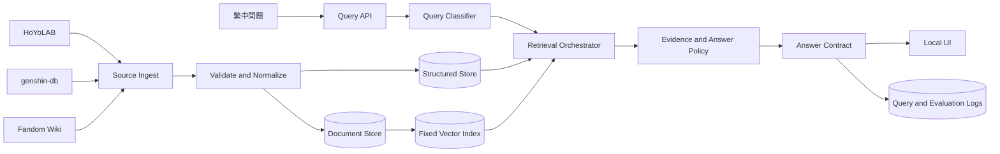
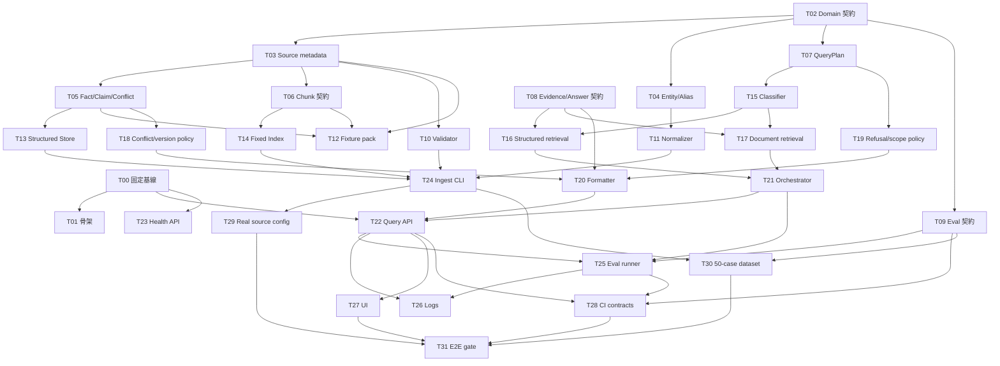

# Genshin-Impact-RAG-Helper 系統設計文件

| 文件項目 | 內容 |
|---|---|
| 文件版本 | 0.1 SD Baseline Draft |
| 文件日期 | 2026-08-20 |
| 文件狀態 | 待 SD Review Gate |
| 上游文件 | [`docs/02-system-analysis.md`](02-system-analysis.md) |
| 適用分支 | `dev` |
| 設計方向 | 固定技術基線、Local-first、fixture-first |

## 1. 設計範圍與已確認限制

本文件把 SA 的需求基線轉成可實作的架構邊界、資料契約、API 契約、ADR 與細粒度 Task DAG。設計只涵蓋 MVP 的本機可執行核心，不建立公開服務營運架構。

已確認限制：

- 核心功能採 Local-first，月度預算為 NT$0。
- `main` 是穩定分支，`dev` 是開發主線。
- 技術基線視為固定前提；本專案不規劃替換模型、Embedding、Vector DB、後端或 UI 的備援路線。
- 本階段不做效能 benchmark、容量測試或模型替換評估；效能不列為本次 SD Review Gate。
- 資料來源的實際擷取介面、授權與保存量仍需依 SA 的 OPEN-01～OPEN-07 完成確認。
- 需求與輸出契約先用 fixture 固定，讓不同 Task 可平行開發；真實資料不作為上游 Task 的必要前置條件。

本文件不捏造尚未提供的模型名稱、版本或框架版本。`T00` 只負責把實際固定基線補入決策紀錄，不比較替代方案；在 `T00` 完成前，後續 Task 仍可依本文件的契約與 fixture 進行。

## 2. 固定基線與邊界

### 2.1 固定基線登錄

| 項目 | 固定內容 | 狀態／責任 |
|---|---|---|
| 作業環境 | Windows 10、Intel i7-12700KF、31.8 GB RAM、RTX 3060 12 GB VRAM | 已確認 |
| 語言與資料格式 | 繁體中文；來源、版本、時間與權利欄位必須可追溯 | 已確認 |
| LLM／推論器 | 本機固定基線；具體名稱與版本於 T00 登錄 | 待登錄，不做替代比較 |
| Embedding | 本機固定基線；具體名稱與版本於 T00 登錄 | 待登錄，不做替代比較 |
| Vector DB／索引 | 本機固定基線；具體名稱與版本於 T00 登錄 | 待登錄，不做替代比較 |
| 後端／UI | 本機固定基線；具體框架於 T00 登錄 | 待登錄，不做替代比較 |
| 外部部署 | 不屬 MVP 核心相依 | 排除 |

### 2.2 元件責任邊界



| 元件 | 責任 | 不負責 |
|---|---|---|
| Source Ingest | 取得或載入來源快照，保留來源識別與擷取資訊 | 生成答案、決定 UI 呈現 |
| Validate／Normalize | 欄位驗證、名稱／別名正規化、版本與權利欄位檢查 | 自行修補缺失事實 |
| Structured Store | 保存可精確查詢的實體、欄位、主張與版本 | 長篇敘述切 chunk |
| Document Store／Vector Index | 保存文件單位、chunk 與固定索引 | 決定來源權威性 |
| Query Classifier | 辨識類別、實體、別名、版本／時間與劇透要求 | 產生沒有證據的答案 |
| Retrieval Orchestrator | 依分類讀取結構化資料／檢索證據並產出 Evidence Bundle | 修改來源內容 |
| Evidence and Answer Policy | 執行來源優先級、版本、衝突、拒答與引用規則 | 自行調高證據不足的信心 |
| Answer Contract | 固定回答、拒答、引用與錯誤的輸出格式 | 保存秘密或個人資料 |
| Query／Evaluation Logs | 保存可診斷的查詢、證據、引用與評估結果 | 保存 API 金鑰、帳號或密碼 |

### 2.3 依賴方向規則

依賴只能由上游契約流向下游實作：

```text
Domain Contracts → Data Contracts → Query Contracts → API/UI Integration
                 ↘ Evaluation Contracts → Test/Release Gate
```

禁止下列耦合：

- UI 直接讀取 Structured Store 或 Vector Index。
- Answer Policy 直接呼叫來源網站。
- Evaluator 依賴 UI DOM 或真實外部來源才能執行。
- Ingest Task 以模型輸出作為資料正確性的唯一依據。
- 任一資料來源的專用欄位滲透到通用 Query／Answer Contract。

## 3. 領域與資料模型

以下是邏輯模型；實際資料庫語法、索引型別與欄位命名在實作 Task 中依固定基線落地，不在此提前綁定特定 ORM。

### 3.1 核心實體

| 實體 | 主要欄位 | 用途 |
|---|---|---|
| `SourceDocument` | `source_id`, `source_kind`, `source_url`, `title`, `published_at`, `retrieved_at`, `game_version`, `locale`, `rights_note`, `content_hash` | 來源文件與快照追溯 |
| `CanonicalEntity` | `entity_id`, `entity_type`, `canonical_name`, `aliases`, `locale` | 角色、武器、素材、任務、地區等正規化實體 |
| `StructuredFact` | `fact_id`, `entity_id`, `field_key`, `value`, `unit`, `game_version`, `source_id`, `validity` | 可精確查詢的欄位／數值 |
| `Claim` | `claim_id`, `claim_key`, `entity_id`, `claim_text`, `game_version`, `source_id`, `authority_rank`, `conflict_group_id` | 敘述性主張與衝突比對 |
| `DocumentChunk` | `chunk_id`, `source_id`, `document_locator`, `text`, `token_hint`, `game_version`, `entity_ids` | 可檢索文件單位 |
| `QueryRun` | `query_id`, `question`, `query_category`, `parsed_constraints`, `created_at` | 查詢與分類紀錄 |
| `EvidenceItem` | `evidence_id`, `query_id`, `source_id`, `chunk_id?`, `fact_id?`, `rank`, `score?`, `support_type` | 回答使用的證據集合 |
| `AnswerRun` | `answer_id`, `query_id`, `answer_status`, `answer_text`, `version_scope`, `uncertainty_reason`, `spoiler_level` | 最終回答或拒答 |
| `Citation` | `answer_id`, `evidence_id`, `source_url`, `title`, `published_at`, `retrieved_at`, `game_version` | 對外引用 |
| `EvalCase` | `case_id`, `question_zh_tw`, `category`, `query_type`, `answerability`, `expected_answer`, `required_facts`, `expected_sources`, `game_version`, `refusal_reason` | 版本化驗收題庫 |
| `EvalResult` | `case_id`, `run_id`, `retrieved_evidence`, `answer`, `citations`, `metric_labels`, `human_review` | 評估結果與人工複核 |

### 3.2 識別與版本規則

- `entity_id`、`source_id`、`fact_id`、`claim_id`、`query_id`、`answer_id` 與 `case_id` 必須穩定且可在日志中關聯。
- `canonical_name` 不取代來源原文；別名與原文均需保留。
- `game_version` 可為明確版本、版本範圍或 `unknown`；`unknown` 不得被當成目前版本。
- `validity` 至少能表達 active、superseded、unknown 或 conflict；不同版本的事實不可互相覆蓋。
- `authority_rank` 固定對應 HoYoLAB=1、genshin-db=2、Fandom=3；時間只能在同等可適用性下作為排序因素。
- `content_hash` 用於偵測同一來源內容的重複匯入，不作為事實正確性的判定。

### 3.3 衝突模型

同一 `claim_key`、實體與適用版本可有多筆 `Claim`。系統依下列順序處理：

1. 先過濾版本與 locale 不適用的主張。
2. 依 `authority_rank` 排序，再比較來源發布／擷取時間。
3. 若一筆主張可明確支配其他主張，輸出支配主張並保留必要引用。
4. 若無法支配，建立 `conflict_group_id`，輸出衝突或拒答，不產生單一肯定答案。

## 4. 資料流程與不變條件

### 4.1 匯入流程

```text
Source Snapshot
  → Source Metadata Validation
  → Content/Schema Validation
  → Name and Alias Normalization
  → Version and Rights Annotation
  → Structured Fact / Claim Extraction
  → Document Chunking
  → Fixed Index Build
  → Fixture / Integrity Report
```

每一階段必須產出可被下一階段讀取的檔案或資料契約；失敗項目停止進入下一階段，不以模型補值。

### 4.2 匯入不變條件

- 沒有 `source_url` 與 `retrieved_at` 的資料不可進入可回答索引。
- 沒有 `game_version` 的資料可以保存，但回答必須標示版本未知。
- 無法辨識實體的文字可保留為未分類文件，但不得被當成精確結構化事實。
- 驗證失敗的批次不得部分覆蓋既有有效資料；採批次版本或可回復的發布邊界。
- 任何可回答的 `StructuredFact` 或 `Claim` 都必須能反查到 `SourceDocument`。

### 4.3 查詢流程

```text
Question
  → Parse constraints / aliases / spoiler
  → Classify query type
  → Structured lookup and/or fixed index retrieval
  → Build EvidenceBundle
  → Apply version / authority / conflict policy
  → Answer, uncertainty, refusal, or error
  → Attach citations and write QueryRun/AnswerRun
```

## 5. 契約設計

### 5.1 QueryRequest

```json
{
  "question": "雷電將軍的元素爆發是什麼？",
  "locale": "zh-TW",
  "game_version": null,
  "spoiler_level": "notice",
  "request_id": "client-generated-or-server-generated"
}
```

規則：`question` 必填且不得為空；`locale` 預設 `zh-TW`；`game_version=null` 表示由系統嘗試判定，但不能默認為最新版本；`spoiler_level` 只影響輸出提示，不得改變證據優先級。

### 5.2 QueryPlan

```text
query_category: structured | narrative | version | composite | out_of_scope
normalized_entities: [{ entity_id?, text, entity_type?, aliases_used[] }]
version_constraint: exact | range | current-unspecified | unknown
retrieval_mode: structured | document | hybrid | none
spoiler_level: none | notice | explicit
```

`QueryPlan` 是 Query Classifier 與 Retrieval Orchestrator 之間的固定契約；下游不得重新猜測已解析的限制。

### 5.3 EvidenceBundle

```text
query_id: string
items:
  - evidence_id: string
    source_kind: hoyolab | genshin-db | fandom
    source_url: string
    source_title: string
    source_published_at?: datetime
    source_retrieved_at: datetime
    game_version?: string
    fact_id?: string
    claim_id?: string
    chunk_id?: string
    rank: integer
    support_type: direct | contextual | conflicting
conflict_groups: [{ conflict_group_id, claim_ids[] }]
```

`EvidenceBundle` 可以由 fixture 建立；Answer Policy 不應依賴真實 Vector DB 才能測試。

### 5.4 AnswerResponse

```text
answer_status: answered | uncertain | refused | error
answer_text: string
query_category: structured | narrative | version | composite | out_of_scope
citations: [{ source_url, title, source_kind, published_at?, retrieved_at?, game_version? }]
version_scope: string | unknown
uncertainty_reason?: insufficient_evidence | source_conflict | version_unknown | out_of_scope | entity_unknown
spoiler_notice?: string
trace_id: string
```

不變條件：

- `answered` 的 `citations` 不得為空。
- `uncertain`／`refused` 必須有原因或可理解的限制說明。
- `error` 只表示系統故障，不可把故障包裝成資料拒答。
- `trace_id` 必須能反查 QueryRun、EvidenceBundle 與 AnswerRun。

### 5.5 Maintainer／Evaluator 契約

維護與評估命令共用下列最小輸出：

```text
run_id: string
input_version: string
started_at: datetime
finished_at: datetime
status: passed | failed | partial
errors: [{ code, message, source_id?, case_id? }]
artifacts: [{ path, content_hash, kind }]
```

命令失敗時必須回傳非零狀態或等價失敗結果；不可產生看似成功的空索引或空評估報告。

## 6. API 邊界

以下是邏輯 API；路由前綴與序列化方式由固定基線的 T00 登錄，不在此假設特定框架。

| Endpoint | 用途 | 主要契約 | 依賴 |
|---|---|---|---|
| `GET /health` | 本機啟動／資料版本健康檢查 | `HealthResponse` | T00、資料狀態 |
| `POST /api/v1/query` | 玩家問答 | `QueryRequest` → `AnswerResponse` | QueryPlan、EvidenceBundle、Answer Policy |
| `POST /api/v1/ingest/validate` | 維護者驗證輸入批次 | `IngestRequest` → `RunResponse` | SourceDocument、Validator |
| `POST /api/v1/ingest/build` | 維護者建立結構化資料／固定索引 | `IngestRequest` → `RunResponse` | Normalize、Store、Index |
| `POST /api/v1/evals/run` | 執行固定題庫評估 | `EvalRunRequest` → `EvalRunResponse` | EvalCase、Query API、Metrics |
| `GET /api/v1/runs/{run_id}` | 讀取維護／評估結果 | `RunResponse` | Logs／Artifacts |

API 邊界規則：

- Query API 不直接暴露來源抓取或索引內部欄位。
- Ingest／Eval 是本機維護路徑，不收集玩家帳號或登入資訊。
- 所有 endpoint 的錯誤需使用可分類的 error code；不得將 stack trace 直接輸出給玩家。
- UI 只能依 `AnswerResponse` 呈現回答、引用、版本與拒答，不自行重建來源連結。

## 7. ADR（Architecture Decision Records）

### ADR-001：Local-first 與零月費核心

**狀態**：Accepted（承接計畫書）

**決策**：核心推論、Embedding、資料儲存、索引與評估均以本機可重現流程為基準；外部服務不得成為持續運作的必要條件。

**理由**：符合 NT$0 預算、隱私與可重現性目標。

**影響**：安裝與硬體限制由 README／T00 明確記錄；不承諾 24/7 公開服務。

### ADR-002：結構化優先，敘述性問題走檢索

**狀態**：Accepted（承接 SA）

**決策**：精確數值／欄位先走 Structured Store；任務、故事與世界觀走 Document／Vector Index；複合問題拆分後分別處理。

**理由**：減少模型自行計算與幻覺，讓不同資料型態可獨立驗收。

**影響**：需要維護實體／別名字典與兩條證據管線。

### ADR-003：來源權威性與版本共同決定主張

**狀態**：Accepted（承接 SA）

**決策**：HoYoLAB > genshin-db > Fandom；先過濾適用版本，再以權威性與時間處理；無法定案時輸出衝突／拒答。

**理由**：避免新舊版本與不同來源被無提示混合。

**影響**：所有 Claim／Fact 必須保留來源、版本、發布／擷取時間與 conflict group。

### ADR-004：Evidence-carrying Answer Contract

**狀態**：Accepted（承接 SA）

**決策**：所有回答先形成 EvidenceBundle，再由 Answer Policy 產生 `AnswerResponse`；非拒答答案必須有引用。

**理由**：把檢索品質與生成品質分開驗收，並支援拒答與人工追溯。

**影響**：UI、API、評估與日誌共用同一輸出契約。

### ADR-005：固定技術基線，不建立替換路線

**狀態**：Accepted（本次方向）

**決策**：MVP 採一套固定的本機 LLM／Embedding／索引／後端／UI 基線；不做效能 benchmark、不比較替代方案、不保留第二套實作路線。實際名稱與版本由 T00 登錄。

**理由**：專案資源有限，優先完成可跑且正確的端到端契約；使用者明確要求不做效能驗證與替換規劃。

**影響**：若固定基線日後不可用，需另開 Change Request；本 SD 不承諾替換成本或效能門檻。

### ADR-006：Fixture-first 與任務契約解耦

**狀態**：Accepted（本次方向）

**決策**：先固定 Domain、Data、Query、Evidence、Answer、Eval 契約，再以 fixture 驗證各 Task；真實來源與 UI 不作為所有下游工作的必要依賴。

**理由**：讓資料、檢索、回答、評估與 UI 可平行開發，減少互相等待。

**影響**：fixture 必須標示為測試資料，不得誤發布成真實來源；整合 Gate 最後再接真實資料。

## 8. 細粒度 Task Breakdown

### 8.1 Task 定義規則

每個 Task 只允許一個主要交付物與一個驗收邊界；Task 不跨越多個 owner 邊界。每個 Task 必須能單獨在分支中完成、測試或文件驗證，並列出硬依賴。`depends_on` 不得形成循環。

Task 狀態：`Planned → In Progress → Review → Done`。若等待的是最終真實來源、模型輸出或 E2E Gate，仍可先以 fixture 開發，不標記為 blocked。

### 8.2 Task 清單

| ID | Task／單一交付物 | 完成條件 | depends_on | 可平行線 |
|---|---|---|---|---|
| T00 | 登錄固定技術基線與本機啟動命令 | ADR-005 的實際名稱／版本、啟動／停止方式與必要環境變數已記錄 | — | Foundation |
| T01 | 建立專案目錄與模組邊界 | 目錄骨架、命名規則、最小啟動入口與禁止跨層依賴檢查 | T00 | Foundation |
| T02 | 建立 Domain enum／ID 契約 | 實體類型、來源類型、回答狀態、版本狀態與錯誤碼 fixture | — | Contract |
| T03 | 建立 SourceDocument／權利 metadata 契約 | 欄位 schema、必填規則、content hash 與範例 fixture | T02 | Data |
| T04 | 建立 CanonicalEntity／Alias 契約 | 正規化名稱、別名、locale 與未辨識狀態 fixture | T02 | Data |
| T05 | 建立 StructuredFact／Claim／Conflict 契約 | 主張鍵、版本、權威級別、衝突群組與排序規則測試 | T02、T03 | Data |
| T06 | 建立 DocumentChunk 契約 | 文件 locator、chunk metadata、版本與實體關聯 fixture | T03 | Data |
| T07 | 建立 QueryRequest／QueryPlan 契約 | 查詢分類、版本限制、劇透與 retrieval mode 的 schema 測試 | T02 | Query |
| T08 | 建立 EvidenceBundle／AnswerResponse 契約 | `answered`／`uncertain`／`refused`／`error` 不變條件測試 | T02、T03、T07 | Query |
| T09 | 建立 EvalCase／EvalResult 契約 | 50 題欄位模板、指標 label、人工複核欄位與範例 | T02、T08 | Evaluation |
| T10 | 建立來源匯入 validator | 缺欄位、格式、重複、版本與權利欄位錯誤可被分類 | T03 | Data |
| T11 | 建立名稱／別名 normalizer | 來源原文保留、正規化結果穩定、未知名稱可追蹤 | T04、T10 | Data |
| T12 | 建立 fixture source pack | 三來源的最小測試快照、版本、衝突與拒答資料 | T03、T05、T06 | Data |
| T13 | 建立 Structured Store 存取層 | `StructuredFact`／`Claim` 可依實體、欄位與版本查詢 | T05、T12 | Data |
| T14 | 建立 Document Store／固定索引建立命令 | `DocumentChunk` fixture 可建索引、清單與 hash 可驗證 | T06、T12 | Retrieval |
| T15 | 建立 Query Classifier | T07 fixture 可分類 structured／narrative／version／out_of_scope | T04、T07 | Query |
| T16 | 建立 Structured Retrieval | 依 QueryPlan 查欄位並輸出 EvidenceBundle | T08、T13、T15 | Retrieval |
| T17 | 建立 Document Retrieval | 依 QueryPlan 從固定索引輸出 EvidenceBundle | T08、T14、T15 | Retrieval |
| T18 | 建立 Conflict／Version Policy | 以 T05 fixture 驗證權威級別、版本與衝突拒答 | T05、T08 | Policy |
| T19 | 建立 Refusal／Scope Policy | out_of_scope、insufficient、unknown entity、version unknown 可分類 | T07、T08 | Policy |
| T20 | 建立 Answer Formatter | EvidenceBundle 轉 AnswerResponse，引用與原因欄位完整 | T08、T18、T19 | Policy |
| T21 | 建立 Query Orchestrator | 依 QueryPlan 合併 structured／document EvidenceBundle | T15、T16、T17、T18 | Query |
| T22 | 建立 Query API | `POST /api/v1/query` 可用 fixture 完成 answered／refused／error | T20、T21、T00 | API |
| T23 | 建立 Health API | `GET /health` 回報固定基線與資料版本狀態 | T00、T13、T14 | API |
| T24 | 建立 Ingest validate／build CLI | validator、normalizer、store、index 可依順序執行並產出 RunResponse | T10、T11、T13、T14 | Ingest |
| T25 | 建立 Evaluation Runner | 讀取 EvalCase、呼叫 Query contract、輸出 EvalResult 與指標 | T09、T21、T22 | Evaluation |
| T26 | 建立查詢／評估 log adapter | QueryRun、AnswerRun、Evidence、EvalResult 可關聯且無秘密 | T08、T09、T22、T25 | Observability |
| T27 | 建立 UI 查詢頁 | UI 只依 AnswerResponse 顯示回答、引用、版本、拒答與劇透提示 | T22、T23 | UI |
| T28 | 建立 CI mock／contract tests | 無真實模型／來源時可跑 schema、policy、API、eval contract tests | T08、T09、T22、T25 | Quality |
| T29 | 建立真實來源匯入設定 | 已確認的來源介面、授權、保存量與更新程序形成可執行設定 | T10、T11、T12、T24、OPEN-01、OPEN-06 | Integration |
| T30 | 建立 50 題正式題庫 | 40 可回答／10 拒答完成人工標註、來源、版本與 fixture mapping | T09、T12、T24、OPEN-01、OPEN-06 | Evaluation |
| T31 | 執行 MVP E2E Release Gate | 真實資料匯入、UI 查詢、引用、拒答、評估報告與 DoD evidence 齊全 | T27、T28、T29、T30 | Release |

### 8.3 依賴 DAG



### 8.4 可平行化分組

在 T02、T03、T07、T08、T09 契約完成後，可採以下平行線：

| 平行線 | 可工作的 Task | 不應直接依賴 |
|---|---|---|
| Data | T10～T14、T24 | UI、真實 LLM 回答 |
| Query／Policy | T15～T23 | 真實來源網站、UI DOM |
| Evaluation | T09、T25、T28、T30 | UI 完成、正式來源全量匯入 |
| UI | T27 | 真實模型品質；使用 AnswerResponse fixture |
| Integration | T29、T31 | 未完成的契約變更 |

### 8.5 Task 完成條件模板

每個實際 issue／分支應填寫：

```text
Task ID:
Goal:
Input contract:
Output artifact:
depends_on:
Out of scope:
Acceptance checks:
Fixture or test data:
Evidence path:
```

若 Task 需要修改上游契約，必須先提出 Change Request；不得在下游實作中偷偷改 schema。

## 9. 測試與 Release 邊界

### 9.1 測試層級

| 層級 | 內容 | 是否依賴真實來源／模型 |
|---|---|---:|
| Contract | schema、enum、錯誤碼、回答不變條件 | 否 |
| Unit | normalizer、validator、排序、版本／衝突／拒答 policy | 否 |
| Component | store、index、retrieval、formatter | fixture 即可 |
| API | Query、Health、Ingest、Eval endpoint | fixture 即可 |
| Integration | 真實來源匯入、固定基線、本機 UI | 是 |
| Release Gate | 50 題、引用、拒答、DoD evidence | 是 |

本次 SD 不加入效能測試層級，不設定延遲、吞吐、VRAM 或容量門檻。

### 9.2 Release Gate 輸入

Release Gate 只檢查 SA 已核准的功能／品質項目：回答正確率、Recall@5、Groundedness、正確拒答率與非拒答來源率。效能不在本次 Gate；若未來新增，須以 Change Request 加入新的驗收條件。

## 10. SD Review Gate

SD 通過前需確認：

- 固定技術基線已由 T00 登錄；不包含替換方案或 benchmark 承諾。
- 元件邊界、依賴方向與契約符合 SA FR／NFR。
- Domain、Source、Query、Evidence、Answer、Eval 契約可由 fixture 驗證。
- Task DAG 無循環；每個 Task 有單一交付物、完成條件與明確硬依賴。
- 可平行化分組不依賴 UI、真實來源或真實模型才能開始。
- API、資料模型、衝突／版本／拒答政策與測試層級一致。
- T29／T30 之前的開發可以 fixture-first；真實來源與授權不會阻塞契約與 policy Task。
- 未決事項與 Change Request 入口已明確，沒有把未確認內容寫成已核准事實。

## 11. 下一步

1. 由專案擁有者確認 T00 的固定技術基線值。
2. 將 T00～T31 轉成 GitHub Issues／Milestone，保持 `depends_on` 與平行線欄位。
3. 先完成 T02、T03、T07、T08、T09 等契約 Task，再平行展開 Data、Query、Evaluation、UI 線。
4. SD Review 通過後，依 Task DAG 開始第一批可獨立驗收的工作。

